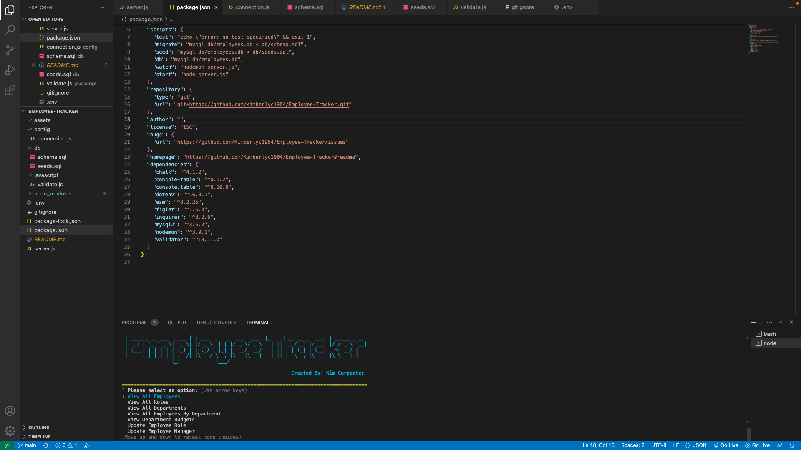

# Employee-Tracker
Employee Tracker

## Description

- What was your motivation? My motivation behind building an Employee Tracker app is to create an app that can track employees, salary, job description and other employment related information.

- Why did you build this project? Building the Employee Tracker was driven by a desire to track employees and related employment information.
  
- What problem does it solve? It solves the issue of being able to keep a record of employees and their pertinent employment information.
  
- What did you learn? Learned how to somewhat configure a backend solution.
  
## User Story
```
AS A business owner
I WANT to be able to view and manage the departments, roles, and employees in my company
SO THAT I can organize and plan my business.
```

## Acceptance Criteria
```
GIVEN a command-line application that accepts user input
WHEN I start the application
THEN I am presented with the following options: view all departments, view all roles, view all employees, add a department, add a role, add an employee, and update an employee role
WHEN I choose to view all departments
THEN I am presented with a formatted table showing department names and department ids
WHEN I choose to view all roles
THEN I am presented with the job title, role id, the department that role belongs to, and the salary for that role
WHEN I choose to view all employees
THEN I am presented with a formatted table showing employee data, including employee ids, first names, last names, job titles, departments, salaries, and managers that the employees report to
WHEN I choose to add a department
THEN I am prompted to enter the name of the department and that department is added to the database
WHEN I choose to add a role
THEN I am prompted to enter the name, salary, and department for the role and that role is added to the database
WHEN I choose to add an employee
THEN I am prompted to enter the employee’s first name, last name, role, and manager, and that employee is added to the database
WHEN I choose to update an employee role
THEN I am prompted to select an employee to update and their new role and this information is updated in the database 
```

## Table of Contents

- [Employee-Tracker](#employee-tracker)
  - [Description](#description)
  - [User Story](#user-story)
  - [Acceptance Criteria](#acceptance-criteria)
  - [Table of Contents](#table-of-contents)
  - [Usage](#usage)
  - [GitHub](#github)
  - [Youtube Videos](#youtube-videos)
  - [Sources](#sources)

## Usage

Can be used to keep track of employees.





## GitHub
https://github.com/Kimberlyc1904/Employee-Tracker

## Youtube Videos
```
https://youtu.be/hUszMqYI9J0
```

## Sources
```
ChatGPT
W3 Schools
Github
Google
Stack Overflow
```
